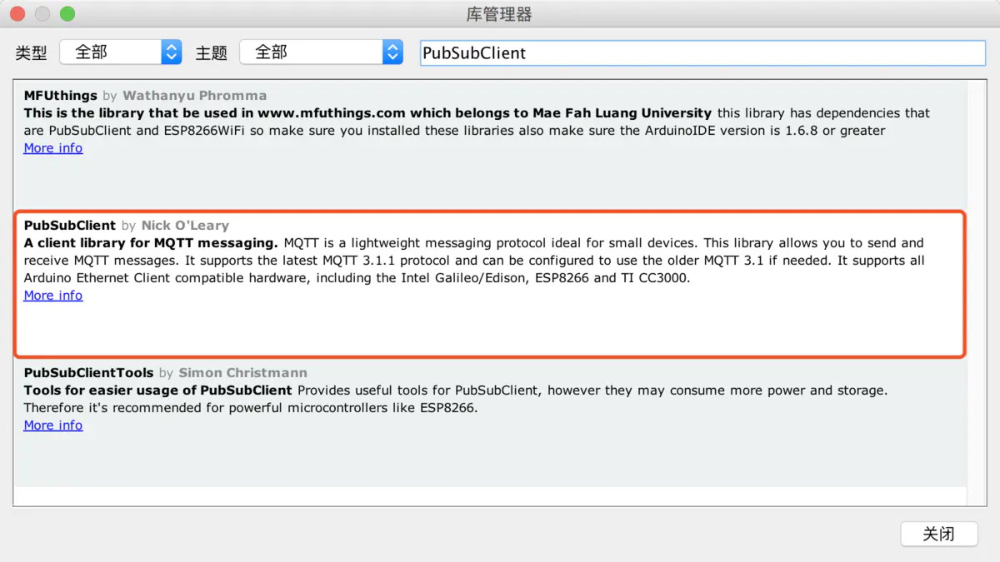

# MQTT之 PubSubClient 库

我在[MQTT简介](https://www.jianshu.com/p/6bcb9f45936d)中的ESP8266的示例显得有点复杂，虽说Adafruit的库貌似很强大，但从软件角度来看却显得非常的臃肿，简洁至尚才是写代码的王道。

幸亏MQTT的库有非常的多，这里我会采用一款更简单好用的库PubSubClient来做一个最简单的MQTT客户端。

PubSubClient可以在Arduino IDE的库管理器中找到：



然后我们来写个例子，当ESP8266收到来自`home/devices/onoff/`主题中值为`1`的信息就点亮板载的LED，收到`0`就熄灭LED。

首先定义基本的变量：

```c
#include <ESP8266WiFi.h>
#include <PubSubClient.h>

const char* ssid = "网络SSID";
const char* password = "密码";
const char* mqtt_server = "broker.mqtt-dashboard.com"; // 使用HIVEMQ 的信息中转服务
const char* TOPIC = "home/devices/onoff/";                     // 订阅信息主题
const char* client_id = "clientId-ApjJZcy9Dh";                   // 标识当前设备的客户端编号

WiFiClient espClient;                                                         // 定义wifiClient实例
PubSubClient client(espClient);                                         // 定义PubSubClient的实例
long lastMsg = 0;                                                               // 记录上一次发送信息的时长
```

然后是初始化

```c
void setup() {
  pinMode(BUILTIN_LED, OUTPUT);     // 定义板载LED灯为输出方式
  Serial.begin(115200);
  setup_wifi();                                          //执行Wifi初始化，下文有具体描述
  client.setServer(mqtt_server, 1883);    //设定MQTT服务器与使用的端口，1883是默认的MQTT端口
  client.setCallback(callback);                 //设定回调方式，当ESP8266收到订阅消息时会调用此方法
}
```

接下来是初始化WIFI

```c
void setup_wifi() {

  delay(10);
  // 板子通电后要启动，稍微等待一下让板子点亮
  Serial.println();
  Serial.print("Connecting to ");
  Serial.println(ssid);

  WiFi.begin(ssid, password);

  while (WiFi.status() != WL_CONNECTED) {
    delay(500);
    Serial.print(".");
  }

  Serial.println("");
  Serial.println("WiFi connected");
  Serial.println("IP address: ");
  Serial.println(WiFi.localIP());
}
```

连接成功后会在串口监视器中输出当前ESP8266的IP地址。接下来就是编写回调的逻辑，就是当收到一特定的信息时如何让ESP来执行一个具体动作：

```c
void callback(char* topic, byte* payload, unsigned int length) {
  Serial.print("Message arrived [");
  Serial.print(topic);   // 打印主题信息
  Serial.print("] ");
  for (int i = 0; i < length; i++) {
    Serial.print((char)payload[i]); // 打印主题内容
  }
  Serial.println();

  if ((char)payload[0] == '1') {
    digitalWrite(BUILTIN_LED, HIGH);   // 亮灯
  } else {
    digitalWrite(BUILTIN_LED, LOW);   // 熄灯
  }
}
```

> 注意 `void callback(char* topic, byte* payload, unsigned int length)`的参数是固定的，是一个方法接口除了方法名可改，类型与参数个数都不能错。

`payload`传递过来的内容是个二进制的流，所以可以任何的内容，当然上述代码中我们也可以将其转化为整数来用，另外还可以直接传递JSON格式的数据，这样能让数据更加可读。但在单片机的设备间通信还是以“小”为原则， 能传整数的时候绝不传字符串，这样可以大大减轻整体网络通信的负担同时也可以降低单片机运行的功耗。

接下来我们再写一个方法来防止MQTT服务下线，当断开服务时可以尝试重新连接：

```c
void reconnect() {
  while (!client.connected()) {
    Serial.print("Attempting MQTT connection...");
    // Attempt to connect
    if (client.connect(client_id)) {
      Serial.println("connected");
      // 连接成功时订阅主题
      client.subscribe(TOPIC);
    } else {
      Serial.print("failed, rc=");
      Serial.print(client.state());
      Serial.println(" try again in 5 seconds");
      // Wait 5 seconds before retrying
      delay(5000);
    }
  }
}
```

最后就是主循环,主循环的逻辑非常简单：

- MQTT是否连接，没有就重试
- 每隔2秒向`home/status/`主题发一个设备上线的信息

具体代码如下：

```c
void loop() {

  if (!client.connected()) {
    reconnect();
  }
  client.loop();

  long now = millis();
  if (now - lastMsg > 2000) {
    lastMsg = now;
    client.publish("home/status/", "{device:client_id,'status':'on'}");
  }
}
```

以下是本例的全部代码:

```c
#include <ESP8266WiFi.h>
#include <PubSubClient.h>

const char* ssid = "网络SSID";
const char* password = "密码";
const char* mqtt_server = "broker.mqtt-dashboard.com"; // 使用HIVEMQ 的信息中转服务
const char* TOPIC = "home/devices/onoff/";                     // 订阅信息主题
const char* client_id = "clientId-ApjJZcy9Dh";                   // 标识当前设备的客户端编号

WiFiClient espClient;                                                         // 定义wifiClient实例
PubSubClient client(espClient);                                         // 定义PubSubClient的实例
long lastMsg = 0;                                                               // 记录上一次发送信息的时长

void setup() {
  pinMode(BUILTIN_LED, OUTPUT);                               // 定义板载LED灯为输出方式
  Serial.begin(115200); 
  setup_wifi();                                                                    //执行Wifi初始化，下文有具体描述
  client.setServer(mqtt_server, 1883);                              //设定MQTT服务器与使用的端口，1883是默认的MQTT端口
  client.setCallback(callback);                                          //设定回调方式，当ESP8266收到订阅消息时会调用此方法
}

void setup_wifi() {

  delay(10);
  // 板子通电后要启动，稍微等待一下让板子点亮
  Serial.println();
  Serial.print("Connecting to ");
  Serial.println(ssid);

  WiFi.begin(ssid, password);

  while (WiFi.status() != WL_CONNECTED) {
    delay(500);
    Serial.print(".");
  }

  Serial.println("");
  Serial.println("WiFi connected");
  Serial.println("IP address: ");
  Serial.println(WiFi.localIP());
}

void callback(char* topic, byte* payload, unsigned int length) {
  Serial.print("Message arrived [");
  Serial.print(topic);   // 打印主题信息
  Serial.print("] ");
  for (int i = 0; i < length; i++) {
    Serial.print((char)payload[i]); // 打印主题内容
  }
  Serial.println();

  if ((char)payload[0] == '1') {
    digitalWrite(BUILTIN_LED, HIGH);   // 亮灯
  } else {
    digitalWrite(BUILTIN_LED, LOW);   // 熄灯
  }
}

void reconnect() {
  while (!client.connected()) {
    Serial.print("Attempting MQTT connection...");
    // Attempt to connect
    if (client.connect(client_id)) {
      Serial.println("connected");
      // 连接成功时订阅主题
      client.subscribe(TOPIC);
    } else {
      Serial.print("failed, rc=");
      Serial.print(client.state());
      Serial.println(" try again in 5 seconds");
      // Wait 5 seconds before retrying
      delay(5000);
    }
  }
}

void loop() {

  if (!client.connected()) {
    reconnect();
  }
  client.loop();

  long now = millis();
  if (now - lastMsg > 2000) {
    lastMsg = now;
    client.publish("home/status/", "{device:client_id,'status':'on'}");
  }
}
```

That's all! 与Adafruit库相比PubSubClient是不是更加简单实用？

作者：梁睿坤  
链接：https://www.jianshu.com/p/7f54b92d7a7b  
来源：简书  
著作权归作者所有。商业转载请联系作者获得授权，非商业转载请注明出处。
